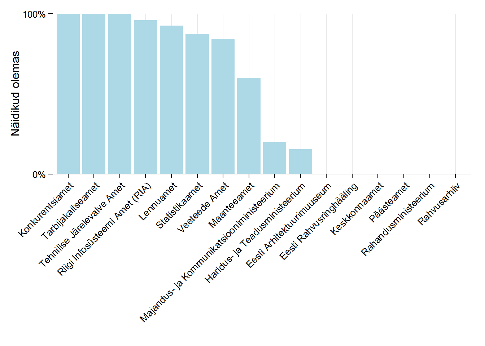
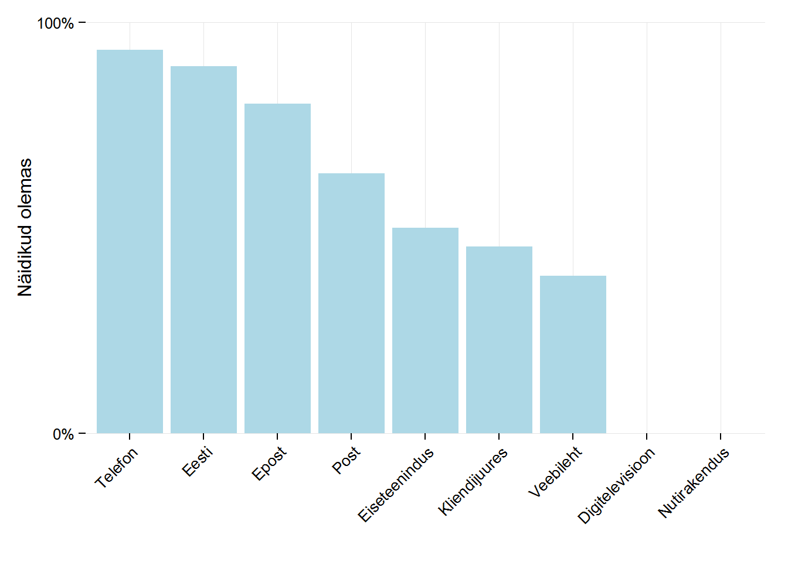
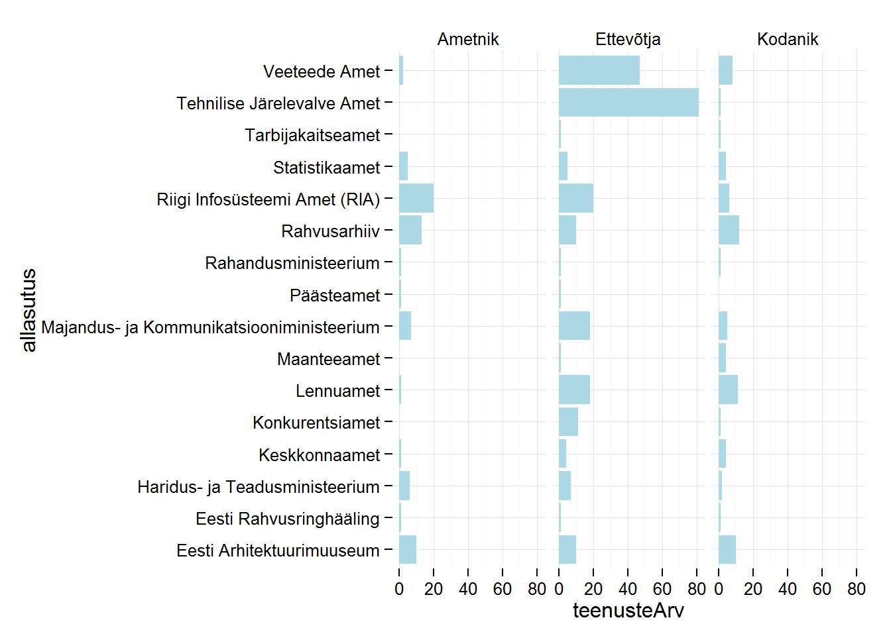

# Riigiteneuste statistika
Risto Hinno  
23. november 2015  

###Statistika näidised

Kui andmed on sisse laetud ja pikaks tehtud saab teha statistikat. Enne lae lehelt [Statistika.r](https://github.com/RRisto/Riigteenuste_analyys/blob/master/Statistika.R "https://github.com/RRisto/Riigteenuste_analyys/blob/master/Statistika.R") funktsioonid sisse.


###Näidised:

- Asutuste lõikes olemasoleva statistika oskaal:

```r
#arvutame välja
summaryAsutus =summeerija(data=andmedPikk, "allasutus")
#paneme kahanevasse järjekorda
summaryAsutus <- transform(summaryAsutus,jrk = reorder(allasutus, -stat_olemas_pr))
#visualiseerime
visualiseerija(data=summaryAsutus, aes(x=jrk, y=stat_olemas_pr), 
               "Näidikud olemas")
```

 

- Kanalite lõikes olemasoleva statistika oskaal:


```r
summaryKanal =summeerija(data=andmedPikk,  "kanal")
summaryKanal <- transform(summaryKanal, jrk = reorder(kanal, -stat_olemas_pr))
visualiseerija(data=summaryKanal, aes(x=jrk, y=stat_olemas_pr), 
               "Näidikud olemas")
```

 


- Näitajate lõikes olemasoleva statistika oskaal


```r
summaryNaitaja =summeerija(data=andmedPikk,  "naitaja")
summaryNaitaja <- transform(summaryNaitaja, jrk = reorder(naitaja, -stat_olemas_pr))
visualiseerija(data=summaryNaitaja, aes(x=jrk, y=stat_olemas_pr), 
               "Näidikud olemas")
```

 


- Teenuste arv sihtgruppide ja asutuste lõikes


```r
sihtgruppStat(andmedLai)+
  coord_flip()+
  theme_minimal()
```

 

